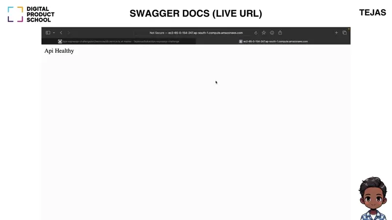
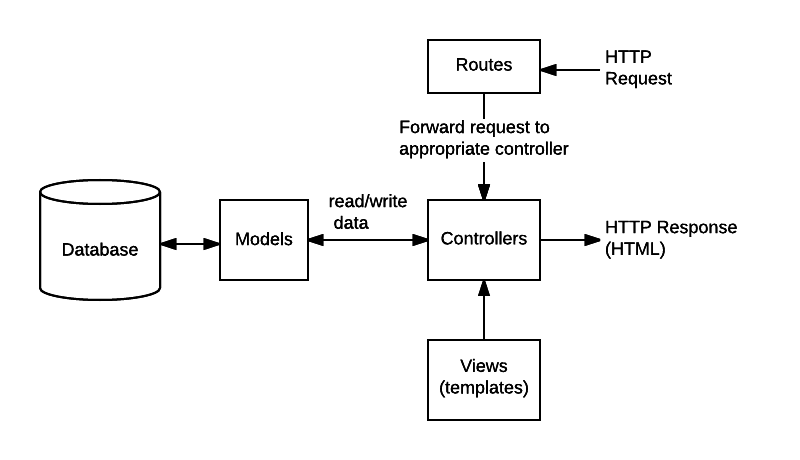
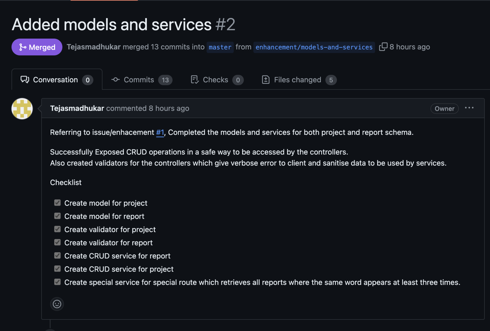
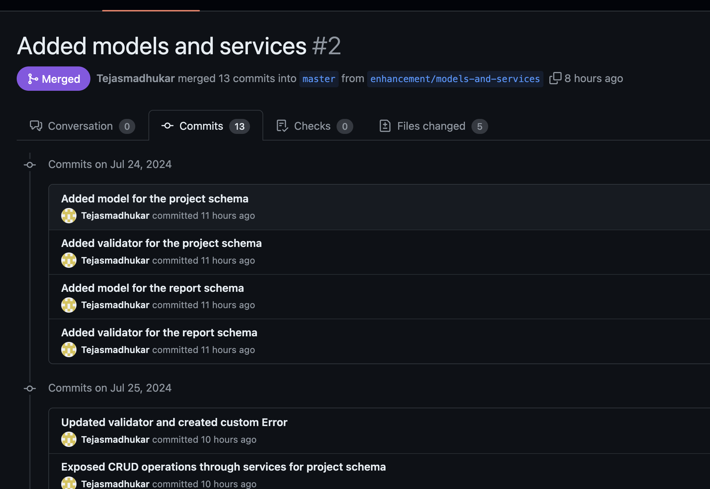

# DPS Backend Coding Challenge

<h2 align="center">

<p align="center">

<p/>

[About](#about) • [Features](#features) • [Coding Practices](#coding-practices) • [Installation](#installation) • [Endpoints](#endpoints) • [Deployment](#deployment) 

</h2>

<div align="center">
<a href="http://ec2-43-205-82-233.ap-south-1.compute.amazonaws.com/docs/#/Projects/get_api_v1_projects" target="_blank">
  
</a>
<a href="https://documenter.getpostman.com/view/28054416/2sA3kYhywC" target="_blank">
  
</a>
</div>

<p align="center">
<a href="https://www.youtube.com/watch?v=7_xwizYJcjo" target="_blank"></a>

<div align="center">
  <a href="https://www.youtube.com/watch?v=7_xwizYJcjo" target="_blank">Click to open video demo</a>
</div>

</p>


## About

<p align="center">

<p/>
👋 Hello! I'm Tejas, Applying for Software Engineer Track at Batch#22 of DPS. This solution for the assignment.

1. This covers the base requirements of task: **RestAPI, the Special Endpoint** and the **Optional task** [(as mentioned in Project Context and Challenge Tasks)](https://github.com/DigitalProductschool/dps-expressjs-challenge?tab=readme-ov-file#project-context)
2. On top of that, this features: [**SwaggerUI Docs**](http://ec2-43-205-82-233.ap-south-1.compute.amazonaws.com/docs), [**Backend Validation**](https://github.com/Tejasmadhukar/dps-expressjs-challenge/blob/e9d3dba9ab90fba3cbdb25e48922b2911fab6f25/src/models/projectModel.ts#L43)
3. Extra features are: [**Deployment on AWS EC2**](http://ec2-43-205-82-233.ap-south-1.compute.amazonaws.com/docs), [**A live Postman Collection**](https://documenter.getpostman.com/view/28054416/2sA3kYhywC), [**Changelog**](https://github.com/Tejasmadhukar/dps-expressjs-challenge/blob/master/CHANGELOG.rst)

## Installation

### 1) Manual Run

```
npm i
npm run dev
```

## Features

| Feature                                            | Explanation                                                                                                 |  PR |
| -------------------------------------------------- | ----------------------------------------------------------------------------------------------------------- |-----|
| ✅ A robust REST API                           | Implemented a RESTful API to expose CRUD operations for project and thier reports.                              |  #4    |
| ✅ Special API Endpoint | Efficiently implemented the special api endpoint |   #2, #9   |
| ✅ Authentication                           | Implemented bearer token authentication with a hardcoded token Password123               |   #5   |
| ✅ Make a changelog.md                                    | Maintained a [changelog](CHANGELOG.rst) to document all changes, ensuring transparency and traceability.                                   |   #2   |
| ✅ Backend deployment                              | Deployed the backend on [AWS](http://ec2-65-0-154-247.ap-south-1.compute.amazonaws.com) access.                                                    |   #10   |
| ✅ Postman collection                              | Created and shared a [Postman collection](https://documenter.getpostman.com/view/28054416/2sA3kYhywC#4a317ab6-facc-4bd3-8c72-cdd8f131322c) for API testing, added the link to the README.                      |   #10   |
| ✅ Documentation & SwaggerUI                       | Added doc string comments and integrated [SwaggerUI](http://ec2-65-0-154-247.ap-south-1.compute.amazonaws.com/docs) for API documentation.                                   |    #10  |

## Coding Practices

### 1) Project Structure

- Followed the **Model-Routes-Controllers-Services Directory Structure** for the application to create separation of logic between DB actions, business logic, and data representation. [[MDN Web Docs: Express.JS]](https://developer.mozilla.org/en-US/docs/Learn/Server-side/Express_Nodejs/routes)
  - 

### 2) Every Feature is a Pull Request

- All features were broken down into sprints in the form of GitHub Issues. Pull Requests (PRs) were raised and merged.

  - 

- The project does not break in any commit.
  - 

### 3) API Documentation and Versioning

- Added [SwaggerUI](https://github.com/swagger-api/swagger-ui) for clear API documentation and implemented versioning (e.g., v1, v2) for backward compatibility.

### 4) Changelog

- For every PR, a changelog fragment is generated specifying the new features introduced, following the [Changelog Standard](https://keepachangelog.com/en/1.1.0/). Check [CHANGELOG.rst](CHANGELOG.rst).

## Endpoints

- To access the endpoints, you need to authorize with the password: `Password123`.

| Endpoint                           | Method | Description                        | Parameters                                                            | Response Status & Description                                                                 |
|------------------------------------|--------|------------------------------------|--------------------------------------------------------------------------|------------------------------------------------------------------------------------------------|
| /api/v1/projects                   | GET    | Get all projects                   |        -                                                           | **200:** List of projects <br> **500:** Internal Server Error                                  |
| /api/v1/projects                   | POST   | Create a new project               |         -                     | **201:** Project created <br> **500:** Internal Server Error                                  |
| /api/v1/projects/{id}              | GET    | Get a project by ID                | `id (string, path)`                                                 | **200:** Project details <br> **400:** Bad Request <br> **404:** Not found <br> **500:** Internal Server Error |
| /api/v1/projects/{id}              | PUT    | Update a project                   | `id (string, path)`            | **200:** Project updated <br> **404:** Not found <br> **500:** Internal Server Error          |
| /api/v1/projects/{id}              | DELETE | Delete a project                   | `id (string, path)`                                             | **200:** Project deleted <br> **404:** Not found <br> **500:** Internal Server Error          |
| /api/v1/reports/project/{projectId}| GET    | Get all reports for a project      | `projectId (string, path)`                                         | **200:** List of reports <br> **404:** No Project Found <br> **500:** Internal Server Error   |
| /api/v1/reports/project/{projectId}| POST   | Create a new report for a project  | `projectId (string, path)`                          | **201:** Report created <br> **500:** Internal Server Error                                   |
| /api/v1/reports/{id}               | GET    | Get a report by ID                 | `id (string, path)`                                                  | **200:** Report details <br> **400:** Bad Request <br> **404:** Not found <br> **500:** Internal Server Error |
| /api/v1/reports/{id}               | PUT    | Update a report                    | `id (string, path)`                        | **200:** Report updated <br> **404:** Not found <br> **500:** Internal Server Error           |
| /api/v1/reports/{id}               | DELETE | Delete a report                    | `id (string, path)`                                                   | **200:** Report deleted <br> **404:** Not found <br> **500:** Internal Server Error           |
| /api/v1/reports/special            | GET    | Special report search              |                                                       | **200:** Search results <br> **404:** No reports found <br> **500:** Internal Server Error    |


## Deployment

- I deployed this project on AWS EC2 using nodejs and nginx.
